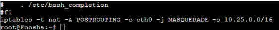
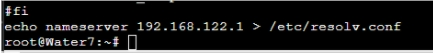
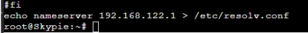
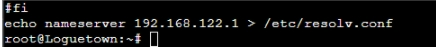
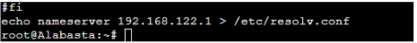

# JARKOM-MODUL-2-D08-2021
- 5111940000233	Aristya Vika Wijaya
- 5111940000199	Aprilia Annisa Suryo
- 5111940000188	Riki Wahyu Nur Dianto

## Soal No 1
EniesLobby akan dijadikan sebagai DNS Master, Water7 akan dijadikan DNS Slave, dan Skypie akan digunakan sebagai Web Server. Terdapat 2 Client yaitu Loguetown, dan Alabasta. Semua node terhubung pada router Foosha, sehingga dapat mengakses internet (1).

Menjalankan command ``iptables -t nat -A POSTROUTING -o eth0 -j MASQUERADE -s 10.25.0.0/16`` yang digunakan supaya dapat terhubung ke jaringan luar pada router `Foosha`

Pada foosha menambahkan command
``echo "iptables -t nat -A POSTROUTING -o eth0 -j MASQUERADE -s 10.25.0.0/16" >> /root/.bashrc``

Dan untuk semua node lainnya ditambahkan
``echo “echo nameserver 192.168.122.1 > /etc/resolv.conf “ >> /root/.bashrc`` agar dijalankan setiap kali project di start.

## Soal No 2
Luffy ingin menghubungi Franky yang berada di EniesLobby dengan denden mushi. Kalian diminta Luffy untuk membuat website utama dengan mengakses franky.yyy.com dengan alias www.franky.yyy.com pada folder kaizoku (2).
Tahapnya:
pertama install `apt-get install nano` dan `apt-get install bash`
lalu buat `script.sh` dan isi dengan instalasi aplikasi
``apt-get update
apt-get install nano
apt-get install bind9 -y``

Pada console **EniesLobbby** command  ``nano /etc/bind/named.conf.local
Kemudian tambahkan 
``
zone "franky.D08.com" {
            type master;
            file "/etc/bind/kaizoku/franky.D08.com";
    };``
Buat folder kaizoku
``mkdir /etc/bind/kaizoku``

Lalu copy format yang ada di db local ke franky.D08.com yang ada di kaizoku
``cp /etc/bind/db.local /etc/bind/kaizoku/franky.D08.com``

Lalu buka 
``nano /etc/bind/kaizoku/franky.D08.com``
ubah local hostnya menjadi  ``franky.D08.com``
Dan dibagian bawahnya ubah menjadi
``@ IN NS franky.D08.com.
@ IN	A 10.25.2.2
www IN CNAME franky.D08.com.``

setelah itu di console **Loguetown**
install `apt-get install nano` dan `apt-get install bash`
lalu buat `script.sh` dan isi dengan instalasi aplikasi
``apt-get update
apt-get install nano
apt-get install bind9 -y
apt-get install lynx``

setelah itu restart **EniesLobby** dengan ``service bind9 restart``
dan di console **Loguetown** lakukan ``ping www.franky.D08.com

## Soal No 3
## Soal No 4
## Soal No 5
## Soal No 6
## Soal No 7
## Soal No 8
## Soal No 9
## Soal No 10
## Soal No 11
## Soal No 12
## Soal No 13
## Soal No 14
## Soal No 15
## Soal No 16
## Soal No 17
