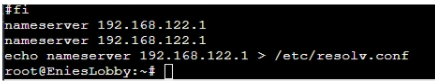

# JARKOM-MODUL-2-D08-2021
- 5111940000233	Aristya Vika Wijaya
- 5111940000199	Aprilia Annisa Suryo
- 5111940000188	Riki Wahyu Nur Dianto

## Soal No 1
EniesLobby akan dijadikan sebagai DNS Master, Water7 akan dijadikan DNS Slave, dan Skypie akan digunakan sebagai Web Server. Terdapat 2 Client yaitu Loguetown, dan Alabasta. Semua node terhubung pada router Foosha, sehingga dapat mengakses internet (1).

****Tahapnya****
Menjalankan command ``iptables -t nat -A POSTROUTING -o eth0 -j MASQUERADE -s 10.25.0.0/16`` yang digunakan supaya dapat terhubung ke jaringan luar pada router `Foosha`

Pada foosha menambahkan command
``echo "iptables -t nat -A POSTROUTING -o eth0 -j MASQUERADE -s 10.25.0.0/16" >> /root/.bashrc``


Dan untuk semua node lainnya ditambahkan
``echo “echo nameserver 192.168.122.1 > /etc/resolv.conf “ >> /root/.bashrc`` agar dijalankan setiap kali project di start.





## Soal No 2
Luffy ingin menghubungi Franky yang berada di EniesLobby dengan denden mushi. Kalian diminta Luffy untuk membuat website utama dengan mengakses franky.yyy.com dengan alias www.franky.yyy.com pada folder kaizoku (2).
****Tahapnya:****
pertama install `apt-get install nano` dan `apt-get install bash`
lalu buat `script.sh` dan isi dengan instalasi aplikasi
``` bash
apt-get update
apt-get install nano
apt-get install bind9 -y
```

Pada console **EniesLobbby** command  ``nano /etc/bind/named.conf.local
Kemudian tambahkan 
``` bash
zone "franky.D08.com" {
            type master;
            file "/etc/bind/kaizoku/franky.D08.com";
    };
```
Buat folder kaizoku
``mkdir /etc/bind/kaizoku``

Lalu copy format yang ada di db local ke franky.D08.com yang ada di kaizoku
``cp /etc/bind/db.local /etc/bind/kaizoku/franky.D08.com``

Lalu buka 
``nano /etc/bind/kaizoku/franky.D08.com``
ubah local hostnya menjadi  ``franky.D08.com``

Dan dibagian bawahnya ubah menjadi
``` bash
@   IN        NS franky.D08.com.
@   IN        A 10.25.2.2
www IN      CNAME franky.D08.com.
```

setelah itu di console **Loguetown**
install `apt-get install nano` dan `apt-get install bash`
lalu buat `script.sh` dan isi dengan instalasi aplikasi
``` bash
apt-get update
apt-get install nano
apt-get install bind9 -y
apt-get install lynx
```

setelah itu restart **EniesLobby** dengan ``service bind9 restart``
dan di console **Loguetown**  ubah nameserver menjadi nameserver EniesLobby yaitu `10.25.2.2` dan lakukan ``ping www.franky.D08.com``


## Soal No 3
Setelah itu buat subdomain super.franky.yyy.com dengan alias www.super.franky.yyy.com yang diatur DNS nya di EniesLobby dan mengarah ke Skypie(3). 

****Tahapnya:****

Menambhkan zone di ``/etc/bind/named.conf.local``
``` bash
zone "super.franky.D08.com" {
            type master;
            file "/etc/bind/kaizoku/super.franky.D08.com";
 ```

Buka ``nano /etc/bind/kaizoku/franky.D08.com``
Lalu tambahkan
``` bash
ns1     IN      A       10.25.2.4 ; IP Skypie
super   IN      NS      ns1
```
Lalu pada command
``cp /etc/bind/db.local /etc/bind/kaizoku/super.franky.D08.com``

Konfigurasi file `/etc/bind/kaizoku/super.franky.D08.com` dengan mengubah localhostnya menjadi `super.franky.D08.com dan` dibagian bawahnya tambahkan
``` bash
@       IN      NS      super.franky.D08.com.
@       IN      A       10.25.2.4
www     IN     CNAME    super.franky.D08.com.
```

setelah itu restart **EniesLobby** dengan ``service bind9 restart``
dan di console **Loguetown**  ubah nameserver menjadi nameserver EniesLobby yaitu `10.25.2.2` dan lakukan ``ping www.super.franky.D08.com``


## Soal No 4
Buat juga reverse domain untuk domain utama (4). 
****Tahapnya:****

Di EniesLobby command:
``nano /etc/bind/named.conf.local``

Lalu tambahkan 
```bash
zone "2.25.10.in-addr.arpa" {
            type master;
            file "/etc/bind/kaizoku/2.25.10.in-addr.arpa";
    };
```

Lalu
```cp /etc/bind/db.local /etc/bind/kaizoku/2.25.10.in-addr.arpa```

Selanjutkan di dalam ``/etc/bind/kaizoku/2.25.10.in-addr.arpa``
Ubah locahost menjadi `franky.D08.com.`

Dibagian bawahnya ubah menjadi
``` bash
2.25.10.in-addr.arpa. IN NS franky.D08.com.
2 IN PTR franky.D08.com.
```

setelah itu restart **EniesLobby** dengan ``service bind9 restart``
dan di console **Loguetown**  ubah nameserver menjadi nameserver EniesLobby yaitu `10.25.2.2` dan lakukan ``ping www.super.franky.D08.com``


## Soal No 5
Supaya tetap bisa menghubungi Franky jika server EniesLobby rusak, maka buat Water7 sebagai DNS Slave untuk domain utama (5). 
****tahapnya:****
**Di EniesLobby** command
``nano /etc/bind/named.conf.local``

Didalamnya tambahkan
``` bash
zone "franky.D08.com" {
            type master;
            notify yes;
            also-notify { 10.25.2.3; };
            allow-transfer { 10.25.2.3; };
            file "/etc/bind/kaizoku/franky.D08.com";
    };
 ```
Lalu restart

**Lalu buka console **Water7****
Kemudian command
``nano /etc/bind/named.conf.local``

Lalu tambahkan zone berikut:
``` bash
zone "franky.D08.com" {
        type slave;
        masters {10.25.2.2;};
        file "/var/lib/bind/franky.D08.com";
    };
 ```
 Setelah disimpan maka lakukan:
`Service bind9 start` di console **Water7**	
`Service bind9 stop` di console  **EinesLobby**

**Buka console **Loguetown****
Tambahkan nameserver water 7 yaitu `10.25.2.3`
`ping franky.D08.com` di console **Loguetown**


## Soal No 6
Setelah itu terdapat subdomain mecha.franky.yyy.com dengan alias www.mecha.franky.yyy.com yang didelegasikan dari EniesLobby ke Water7 dengan IP menuju ke Skypie dalam folder sunnygo(6). 

****Tahapnya:****
**Di console EniesLobby**
lakukan command ``nano /etc/bind/kaizoku/franky.D08.com``

Lalu mengedit di bagian bawah sendiri dengan menambahkan
``` bash
ns2     IN      A       10.25.2.3 ; IP Water7
mecha   IN      NS      ns2
```

Lalu tambahkan
``nano /etc/bind/named.conf.options``

Didalamnya komen ``dnssec-validation auto;`` dan tambahkan baris
``allow-query{any;};``

Pastikan sudah ada line ``allow-transfer {"IP Water7";};`` pada zone franky.D08.com di file ``/etc/bind/named.conf.local``

**Buka console di **Water7****
Command
``nano /etc/bind/named.conf.local``

Lalu didalamnya tambahkan
``` bash
zone "mecha.franky.D08.com" {
            type master;
            file "/etc/bind/sunnygo/mecha.franky.D08.com";
};
```
Lalu buka file options untuk mengedit isinya
``nano /etc/bind/named.conf.options``

Didalamnya komen ``dnssec-validation auto;`` dan tambahkan baris
``allow-query{any;};``

Lalu buat folder sunnygo dengan command
``mkdir /etc/bind/sunnygo``
Lalu copy
``cp /etc/bind/db.local /etc/bind/sunnygo/mecha.franky.D08.com``

Setelah itu didalam file ``/etc/bind/sunnygo/mecha.franky.D08.com``
Ubah localhost menjadi ``mecha.franky.D08.com.``
Dan dibagian bawah sendiri tambahkan
``` bash
@	IN	NS		mecha.franky.D08.com.
@ 	IN	A		10.25.2.4
www	IN	CNAME		mecha.franky.D08.com.
```
Setelah disimpan maka lakukan:
`Service bind9 start` di console **Water7**	
`Service bind9 stop` di console  **EinesLobby**

**Buka console **Loguetown****
Tambahkan nameserver water 7 yaitu `10.25.2.3`
`ping franky.D08.com` di console **Loguetown**
![6].(./images/6.jpg)


## Soal No 7
Untuk memperlancar komunikasi Luffy dan rekannya, dibuatkan subdomain melalui Franky dengan nama general.mecha.frank.yyy.com dengan alias www.general.mecha.franky.yyy.com yang mengarah ke Skypie(7). 
****Tahapnya:****
**Buka console **Water7****
Dibagian ``/etc/bind/named.conf.local``
Tambahkan zone:
``` bash
zone "general.mecha.franky.D08.com" {
            type master;
            file "/etc/bind/sunnygo/general.mecha.franky.D08.com";
    };
```

Lalu tambahkan di dalam ``/etc/bind/sunnygo/mecha.franky.D08.com``
``` bash
ns1	IN      A       10.25.2.4 ; IP Skypie
general	IN      NS      ns1
```

Lalu lakukan pengopian template isi file
``cp /etc/bind/db.local /etc/bind/sunnygo/general.mecha.franky.D08.com``

mengubah localhost menjadi ``general.mecha.franky.D08.com.``

Dan dibagian bawah sendiri tambahkan
``` bash
@	IN	NS	general.mecha.franky.D08.com.
@	IN	A	10.25.2.4
www	IN          CNAME	general.mecha.franky.D08.com.
```

Setelah disimpan maka lakukan:
`Service bind9 start` di console **Water7**	
`Service bind9 stop` di console  **EinesLobby**

**Buka console **Loguetown****
Tambahkan nameserver water 7 yaitu `10.25.2.3`
`ping franky.D08.com` di console **Loguetown**
![7].(./images/7.jpg)

## Soal No 8
## Soal No 9
## Soal No 10
## Soal No 11
## Soal No 12
## Soal No 13
## Soal No 14
## Soal No 15
## Soal No 16
## Soal No 17
